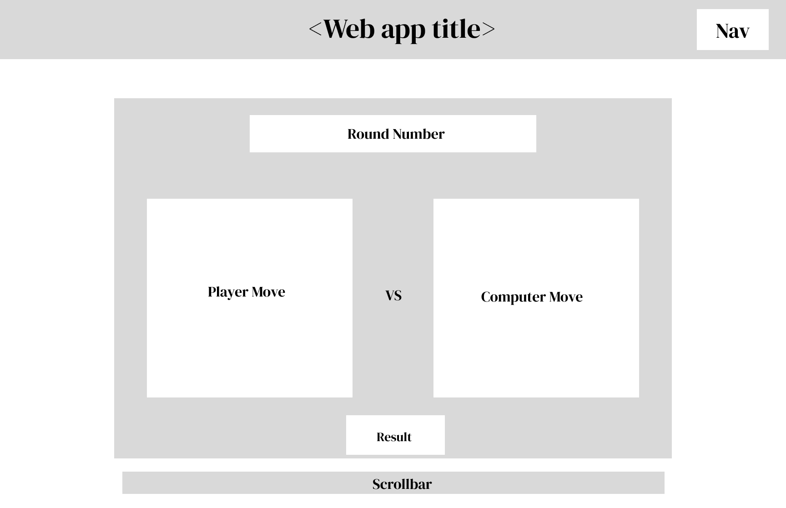

# Containerized App Exercise

Build a containerized app that uses machine learning. See [instructions](./instructions.md) for details.

# Teammates

* Jonason Wu (jw5911): [Github Profile](https://github.com/JonasonWu)
* Brian Lin (bl2814): [Github Profile](https://github.com/blin007)
* Robert Chen (yc3363): [Github Profile](https://github.com/RobertChenYF)
* Alejandro Olazabal (ajo351): [Github Profile](https://github.com/aleolazabal)
* Mark Chen (xc2097): [Github Profile](https://github.com/markizenlee)
* Benji Luo (hjl464): [Github Profile](https://github.com/BenjiLuo) 

# Product Vision Statement

We contructed an app that holds rock-paper-scissor games between a single player and the computer.

* ML client
    * Allow users to use the camera to play a game of rock paper scissors with the computer.
* Web App
    * Displays the results and the moves of each rock paper scissor game played on the ML client.
* DB
    * Stores the rounds of each game of rock paper scissor played on the ML client.

# Figma Wireframe


# Run the app

Please start the web app and database before running the ML client.<br>

The ML client use packages not supported on **Apple silicon machine**, so our app does not work on Apple silicon Mac.

## Run the web app and database

Download Docker Desktop.[link](https://www.docker.com/)

Inside the directory of the project
```
docker-compose up
```

At this point the database and the web app should be running. <br>

To access the home page of the web app, type in this link in your browser. http://localhost:3000/ <br>

The web app is now displayed without any game data. <br>

In order to play the rock-paper-scissor game and see records of your game on the web app, please run the ML client as follows. <br>

## Run the ML Client

Look at [README.md](./machine-learning-client) file.

## Game Play Explained

Each rock paper scissor game between the user and the computer contains five non-tie valid rounds. <br>

Each time the user runs the machine learning client, the camera will be turned on, and one single game consisting of 5 non-tie valid rounds will be played. <br>

In each round, the user will make gestures in front of the camera. When the countdown time is up, the gesture the user is showing will be captured, while what the computer plays will be shown on screen. <br>

Once 5 non-tie valid rounds are played, the ML client will show the result of the game. Click a random key to exit. <by>

If you want to play another game, just run the ML client again. <br>

# Test the app locally
* Look at [README.md](./machine-learning-client/tests) file for steps to test the machine-learning-client.
* Look at [README.md](./web-app/tests) file for steps to test the web-app.

# Other Links
* How to run the web-app without docker:
    * Look at [README.md](./web-app) file.
* Figma wireframes and designs
    * [Figma](https://www.figma.com/file/G3z7dBJrnSTq7WPm62RrOA/RPS?node-id=0%3A1&t=6tux87ZeU1GXvetP-0)


